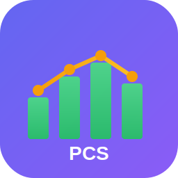

<p align="center">
  
</p>

<h1 align="center">Picture Can See</h1>

<p align="center">
  <strong>强大直观的数据可视化工具</strong>
</p>

<p align="center">
  <a href="#功能特性">功能特性</a> •
  <a href="#安装">安装</a> •
  <a href="#快速开始">快速开始</a> •
  <a href="#文档">文档</a> •
  <a href="#贡献">贡献</a>
</p>

<p align="center">
  English | <a href="README.md">简体中文</a>
</p>

<p align="center">
  
  
  
  
  
  
  
</p>

<p align="center">
  
  
  
  
</p>

---

## 简介

**Picture Can See** 是一款现代化的跨平台数据可视化应用，能够轻松将原始数据转换为精美的可视化图表。无论您是数据分析师、研究人员、学生还是商务人士，这款工具都能让数据可视化变得简单易用。

### 为什么选择 Picture Can See？

- **零学习成本**：拖放数据文件即可获得即时可视化效果
- **智能推荐**：基于数据特征的人工智能图表类型建议
- **多种导出格式**：一键导出为 PNG、SVG、PDF 或 HTML
- **跨平台支持**：提供 Web 应用和桌面应用（Windows、macOS、Linux）
- **隐私优先**：所有处理均在本地进行 - 您的数据不会离开设备
- **无需依赖**：离线可用，无需网络连接

---

## 功能特性

### 数据输入

| 方式 | 描述 | 支持格式 |
|------|------|----------|
| 拖放上传 | 直接将文件拖放到应用程序 | CSV, Excel, JSON, TSV, TXT |
| 粘贴数据 | 从剪贴板直接粘贴数据 | CSV, JSON |
| 手动输入 | 在类似电子表格的界面中编辑数据 | - |

### 支持的图表类型

| 图表 | 图标 | 适用场景 | 示例用例 |
|------|------|----------|----------|
| 柱状图 | 📊 | 类别比较 | 产品销量对比 |
| 折线图 | 📈 | 时间趋势 | 股价、温度变化 |
| 饼图 | 🥧 | 占比关系 | 市场份额 |
| 散点图 | ⚬ | 相关性分析 | 身高体重关系 |
| 雷达图 | 🎯 | 多维对比 | 技能评估 |
| 面积图 | 🏔️ | 累积趋势 | 收入增长 |

### 智能功能

- **自动类型检测**：智能识别数值、日期、分类和文本数据
- **图表推荐**：根据数据特征建议最佳图表类型
- **数据验证**：检测并处理缺失值、异常值和格式错误
- **撤销/重做**：支持所有操作的完整历史记录

### 导出选项

| 格式 | 描述 | 使用场景 |
|------|------|----------|
| PNG | 高分辨率位图 | 演示文稿、报告 |
| SVG | 可缩放矢量图 | 打印、二次编辑 |
| PDF | 便携文档 | 文档归档、分享 |
| HTML | 交互式网页 | 网页嵌入 |
| PCV | 项目文件 | 保存并继续编辑 |

---

## 安装

### 桌面应用

下载适合您平台的最新版本：

| 平台 | 下载 | 大小 |
|------|------|------|
| Windows | [picture-can-see-setup.exe](https://github.com/badhope/picture-can-see/releases) | ~80MB |
| macOS | [picture-can-see.dmg](https://github.com/badhope/picture-can-see/releases) | ~90MB |
| Linux | [picture-can-see.AppImage](https://github.com/badhope/picture-can-see/releases) | ~85MB |

### Web 版本

直接访问 Web 版本：[https://badhope.github.io/picture-can-see/](https://badhope.github.io/picture-can-see/)

或本地运行：

```bash
git clone https://github.com/badhope/picture-can-see.git
cd picture-can-see/web
npx serve -l 3000
```

### 从源码构建

```bash
# 克隆仓库
git clone https://github.com/badhope/picture-can-see.git
cd picture-can-see

# 安装依赖
npm install

# 开发模式运行桌面应用
npm run desktop

# 生产环境构建
npm run desktop:build        # 所有平台
npm run desktop:build:win    # 仅 Windows
npm run desktop:build:mac    # 仅 macOS
npm run desktop:build:linux  # 仅 Linux
```

---

## 快速开始

### 1. 导入数据

**拖放方式**：直接将数据文件拖放到应用程序窗口。

**或使用菜单**：点击"导入数据"并选择文件。

### 2. 选择图表类型

应用程序会自动推荐最适合您数据的图表类型。您也可以手动选择：

- 柱状图
- 折线图
- 饼图
- 散点图
- 雷达图
- 面积图

### 3. 自定义设置

使用配置面板：

- 设置图表标题和副标题
- 调整坐标轴标签
- 更改配色方案
- 启用/禁用图例和提示
- 配置动画效果

### 4. 导出

点击"导出"并选择您需要的格式。

---

## 文档

### 项目结构

```
picture-can-see/
├── .github/                    # GitHub 配置
│   ├── workflows/              # CI/CD 流水线
│   ├── ISSUE_TEMPLATE/         # Issue 模板
│   └── PULL_REQUEST_TEMPLATE.md
│
├── web/                        # Web 应用
│   ├── src/
│   │   ├── core/              # 核心架构
│   │   ├── data/              # 数据处理
│   │   ├── transform/         # 数据转换
│   │   ├── visualization/     # 图表渲染
│   │   ├── export/            # 导出功能
│   │   └── ui/                # UI 组件
│   ├── styles/                # 样式文件
│   ├── locales/               # 国际化
│   └── examples/              # 示例数据
│
├── desktop/                    # 桌面应用
│   ├── src/                   # 源代码（与 Web 共享）
│   ├── main.js                # Electron 主进程
│   └── preload.js             # 预加载脚本
│
├── package.json               # 根包配置
├── LICENSE                    # MIT 许可证
├── CONTRIBUTING.md            # 贡献指南
├── CHANGELOG.md               # 版本历史
└── README.md                  # 本文件
```

### 技术栈

| 类别 | 技术 | 用途 |
|------|------|------|
| 可视化 | D3.js 7 | 数据驱动文档操作 |
| 文件解析 | SheetJS (xlsx) | Excel 文件处理 |
| 桌面端 | Electron | 跨平台桌面应用 |
| 构建 | electron-builder | 应用打包 |
| 样式 | CSS3 | 使用 CSS 变量的现代样式 |
| 架构 | ES Modules | 原生 JavaScript 模块 |

---

## 贡献

我们欢迎社区贡献！详情请参阅[贡献指南](CONTRIBUTING.md)。

### 贡献方式

- 🐛 通过 [Issues](https://github.com/badhope/picture-can-see/issues) 报告 Bug
- 💡 提出新功能建议
- 📝 改进文档
- 🔧 提交 Pull Request
- 🌟 给仓库点 Star

---

## 路线图

### 版本 1.1（计划中）

- [ ] 更多图表类型（热力图、树图、箱线图）
- [ ] 数据筛选和聚合
- [ ] 自定义配色方案
- [ ] 图表模板

### 版本 1.2（计划中）

- [ ] 实时数据流
- [ ] 仪表板创建
- [ ] 云同步（可选）
- [ ] 插件系统

### 版本 2.0（未来）

- [ ] AI 驱动的数据洞察
- [ ] 自然语言查询
- [ ] 协作编辑
- [ ] 移动端伴侣应用

---

## 许可证

本项目采用 MIT 许可证 - 详情请参阅 [LICENSE](LICENSE) 文件。

---

## 致谢

- [D3.js](https://d3js.org/) - 数据驱动文档
- [Electron](https://www.electronjs.org/) - 构建跨平台桌面应用
- [SheetJS](https://sheetjs.com/) - 电子表格数据工具包
- [Feather Icons](https://feathericons.com/) - 精美的开源图标

---

## 支持

- 📖 [文档](https://github.com/badhope/picture-can-see/wiki)
- 🐛 [问题追踪](https://github.com/badhope/picture-can-see/issues)
- 💬 [讨论区](https://github.com/badhope/picture-can-see/discussions)

---

<p align="center">
  由 Picture Can See 团队用 ❤️ 制作
</p>

<p align="center">
  <a href="https://github.com/badhope/picture-can-see/stargazers">
    
  </a>
</p>
